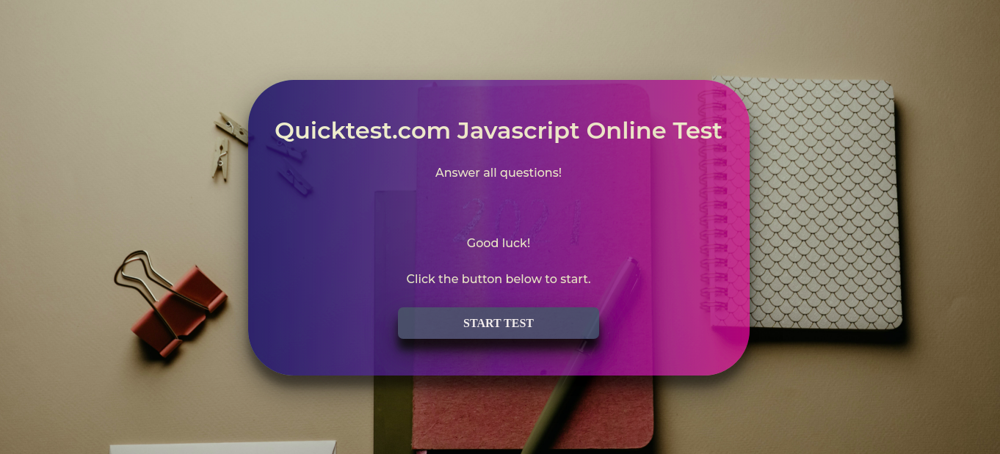
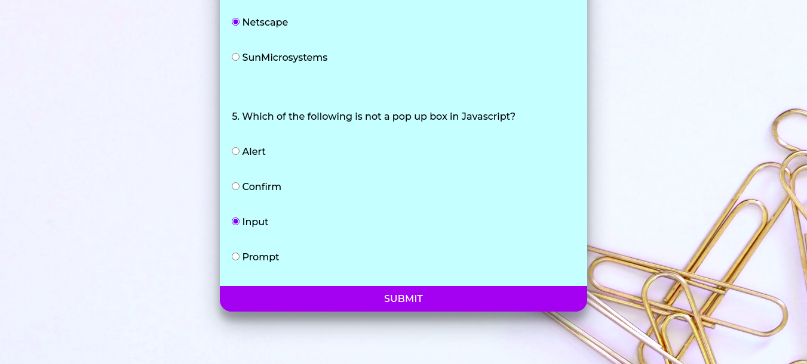
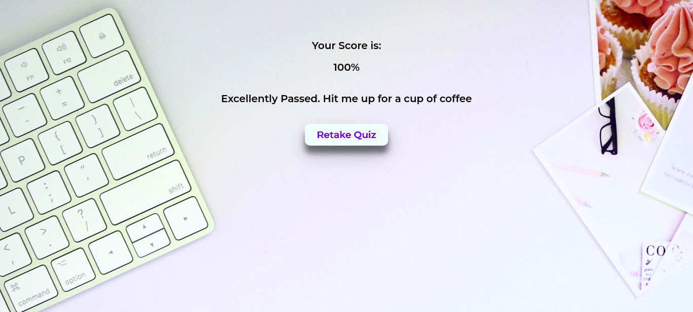

# JAVASCRIPT ONLINE QUICKTEST

 
### FIGMA Design link for this project
https://www.figma.com/file/56ERawE48L9i1Jff1N9ckV/QUICKTEST-WEBSITE-TEMPLATE?node-id=0%3A1

## Table of Contents

+ [Description](#description)
+ [Installation](#installation)
+ [Site Link](#sitelink)
+ [Technology Used](#technology-used)
+ [License](#license)
+ [Author Info](#author-Info)

## Description

This is a website written for students done with highschool and are required to take a Javascript quiz to test their knowledge on what they've learnt so far.

## Installation

If you want to clone this repository to your local machine, use the following command: 

<code> git clone https://github.com/sirgama/quicktest.git</code>

### SITE LINK - GH-PAGES
The landing page is being hosted by Github Pages. The link to the page is:

<a href="https://sirgama.github.io/quicktest/">https://sirgama.github.io/quicktest/</a>

### Technology Used
* HTML - which was used to build the structure of the pages.

* CSS - which was used to style the form inputs, welcome page and result/score section.

* JAVASCRIPT - Used to add functionality to buttons and calculations.

## License

MIT License

Copyright (c) [2022] [Gamaliel Sirengo]. All Rights Reserved.
{Click to view License} (LICENSE)

## Author Info

Gamaliel Sirengo 
https://github.com/sirgama